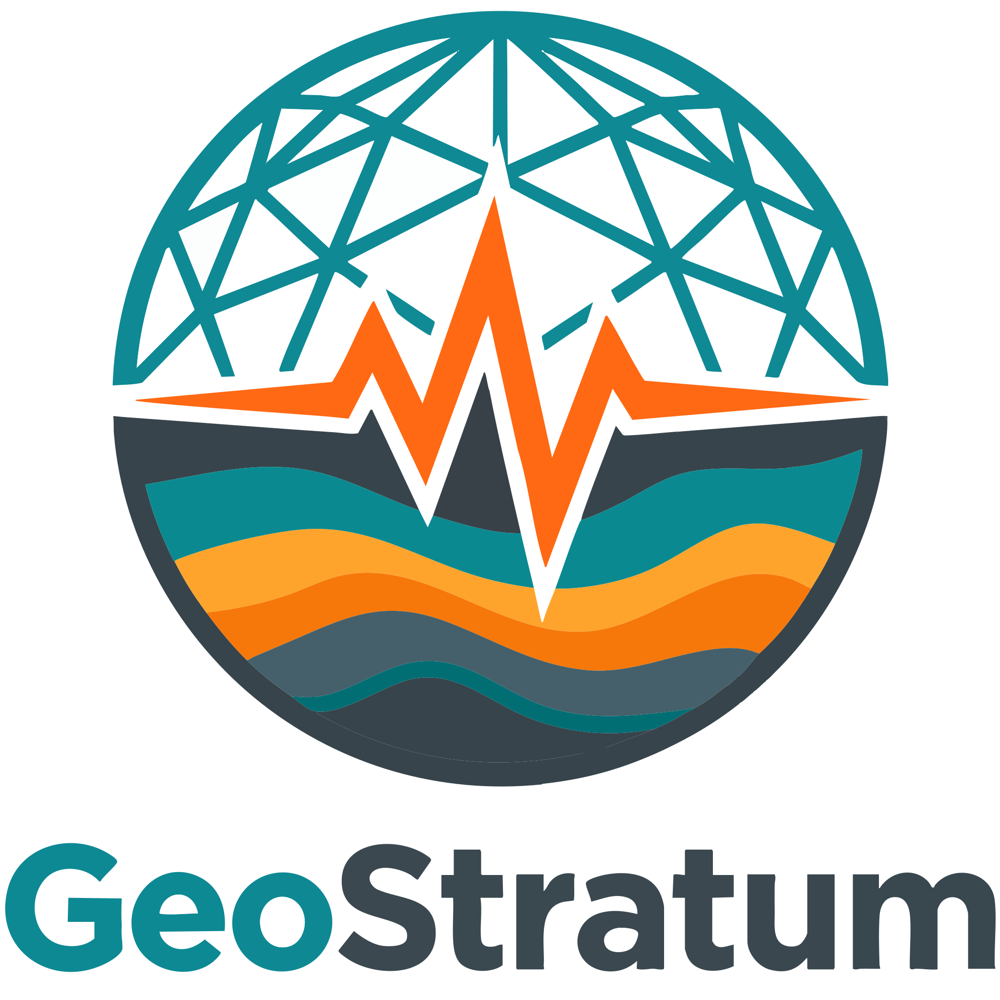

<div align="center">

# GeoStratum — Official Brand Assets & Logos

[](https://www.geostratum.eu/)
[](https://github.com/GeoStratum)
[](LICENSE.md)

<br/>



<p>
  <strong>Geoscience Software & AI Solutions for professional geology.</strong><br/>
  <em>Official visual identity, vector graphics, logos, banners, and digital media assets.</em>
</p>

[**Official Website**](https://www.geostratum.eu/) • [**License & Usage Terms**](LICENSE.md) • [**Social Links**](#-official-links--social-media)

</div>

---

## 📌 Overview

This repository hosts and centralizes the official brand assets, vector graphics, web banners, application icons, and visual guidelines for **GeoStratum** (founded by Lohan GUYON).

It serves as the single source of truth for:
- Mobile applications and desktop software solutions developed by GeoStratum.
- The official web portal: [https://www.geostratum.eu](https://www.geostratum.eu).
- Press, documentation, marketing materials, and social media platforms.

---

## 📁 Repository Structure

All visual assets have been systematically categorized and renamed using clear, kebab-case conventions:

```text
GeoStratum/
├── .gitattributes                               # Line ending normalization & Git LFS tracking
├── .gitignore                                   # Ignore OS, editor, and build artifacts
├── LICENSE.md                                   # Proprietary brand license (All Rights Reserved)
├── README.md                                    # Documentation and usage guidelines
└── assets/
    ├── vector/                                  # Scalable resolution-independent vector assets
    │   └── geostratum-logo.svg                  # Master vector emblem (Adobe Illustrator export, 2303x2303)
    │
    ├── ico/                                     # Favicons and native desktop/app icons
    │   └── geostratum-favicon.ico               # Multi-resolution icon container (256x253)
    │
    ├── banners-16x9/                            # Landscape 16:9 widescreen banners & headers
    │   ├── geostratum-banner-1920x1080.png      # Full HD banner (dark backdrop with typography)
    │   ├── geostratum-banner-4096x2304.png      # 4K UHD banner
    │   └── geostratum-banner-ultra-highres-12425x6989.png # Ultra-high-resolution master banner
    │
    └── square/                                  # Square aspect ratio formats (profiles, apps, avatars)
        ├── master-highres/                      # Master archival exports (>12,000 px, Git LFS)
        │   ├── geostratum-master-solid-12285x12285.png       # Solid background master (RGB)
        │   └── geostratum-master-transparent-12285x12285.png # Transparent background master (RGBA)
        │
        └── standard/                            # Production-ready web, mobile & UI sizes
            ├── geostratum-logo-3071x3071.png                 # High-definition square logo
            ├── geostratum-logo-2000x2000.png                 # Medium print & web display
            ├── geostratum-logo-1024x1024.png                 # App store & dashboard icon
            ├── geostratum-logo-round-800x792.png             # Circular emblem with transparency
            ├── geostratum-logo-round-792x792.png             # 1:1 circular balanced emblem
            ├── geostratum-logo-round-400x400.png             # Social media avatar & profile badge
            └── geostratum-logo-round-inverted-800x792.png    # Inverted / flipped variant
```

---

## 🎨 Color Palette & Brand Values

The visual palette reflects the stratification of geological formations blended with modern high-tech analytics:

| Color Role | Hex Code | RGB | Sample |
| :--- | :--- | :--- | :---: |
| **Primary Teal** | `#0F8994` | `rgb(15, 137, 148)` | `■` |
| **Deep Teal** | `#016E74` | `rgb(1, 110, 116)` | `■` |
| **Warm Amber Accent** | `#FEA42D` | `rgb(254, 164, 45)` | `■` |
| **Intense Orange** | `#F6780A` | `rgb(246, 120, 10)` | `■` |
| **Vibrant Orange** | `#FF6914` | `rgb(255, 105, 20)` | `■` |
| **Dark Slate Gray** | `#3B484F` | `rgb(59, 72, 79)` | `■` |
| **Pure White** | `#FFFFFF` | `rgb(255, 255, 255)` | `□` |

---

## 🔒 License & Intellectual Property Terms

> [!CAUTION]
> **PROPRIETARY LICENSE — ALL RIGHTS RESERVED**
>
> All logos, trademarks, graphics, and brand marks in this repository are the exclusive intellectual property of **Lohan GUYON (GeoStratum)**.
> 
> - **No authorization is granted** to copy, modify, distribute, publish, or commercially exploit any asset without express written consent.
> - Unauthorized use of the GeoStratum identity to brand third-party software, libraries, services, or suggest official affiliation is strictly forbidden.
> 
> For full legal terms, refer to the [LICENSE.md](LICENSE.md) file.

---

## 🌐 Official Links & Social Media

- **Website**: [https://www.geostratum.eu](https://www.geostratum.eu)
- **GitHub Organization**: [https://github.com/GeoStratum](https://github.com/GeoStratum)
- **Bluesky**: [@geostratum.bsky.social](https://bsky.app/profile/geostratum.bsky.social)
- **Instagram**: [@geostratum_communication](https://www.instagram.com/geostratum_communication/)
- **Facebook**: [GeoStratum Official](https://www.facebook.com/profile.php?id=61587244822437)
- **YouTube**: [@GeoStratum](https://www.youtube.com/channel/UCj2GVWynWt2H9Up9AP6QEDA)

---

<div align="center">
  <small>© 2025-2026 Lohan GUYON — GeoStratum. All rights reserved.</small>
</div>
